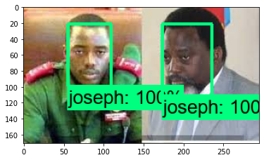
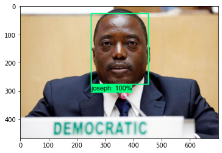
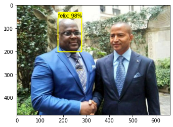

# Utilisation d'un modèle personnalisé de detection des objets  avec Tensorflow

Ce projet contient l'utilisation d'un modèle personnalisé de détection des objets avec le Framework Tensorflow. Et le présent modèle permet de détecter les visages de deux hommes politiques congolais : (1) Felix Tshisekedi et (2) Joseph Kabila.

## Contenu du dépôt
Ce depot contient deux fichiers notebook :
* [Le premier fichier ](Entrainement_du_model_et_detection_.ipynb) contient le code qui nous a permis de créer le modèle personnalisé de detection des objects.  Ce fichier a été crée et executé sur Google Colab lié à Google drive.
* [Et le second ](test.ipynb), le code qui utilise le modèle. Ce fichier a été crée sur la machine locale et testé avec jupyter notebook.

## Avant execution
Rassurez-vous de disposer de :
* L'API de detection d'object de tensorflow <a href="https://www.tensorflow.org/hub/tutorials/object_detection">(TFOD) 
* [Tensorflow](https://www.tensorflow.org/install?hl=fr) 
* [Anacoda](https://www.anaconda.com/products/individual) ou un autre conteneur.

## Resultats de notre modèle

## Pour en savoir plus
Consulter :

* [La documentation officiel Tensorflow sur la detection des objects](https://tensorflow-object-detection-api-tutorial.readthedocs.io/")
* [Tensorflow Object Detection in 5 Hours with Python | Full Course with 3 Projects](https://youtu.be/yqkISICHH-U)
* [Install Tensorflow Object Detection From Scratch in 5 Steps | Python Deep Learning](https://youtu.be/dZh_ps8gKgs)
